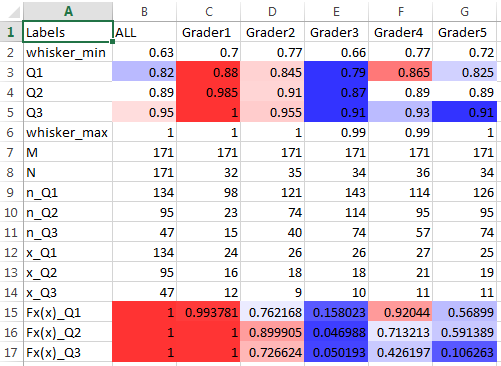
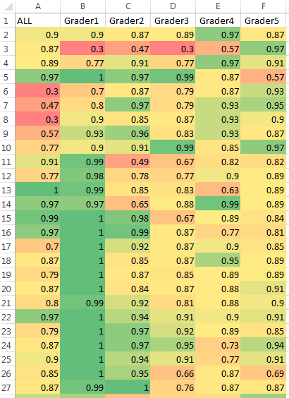
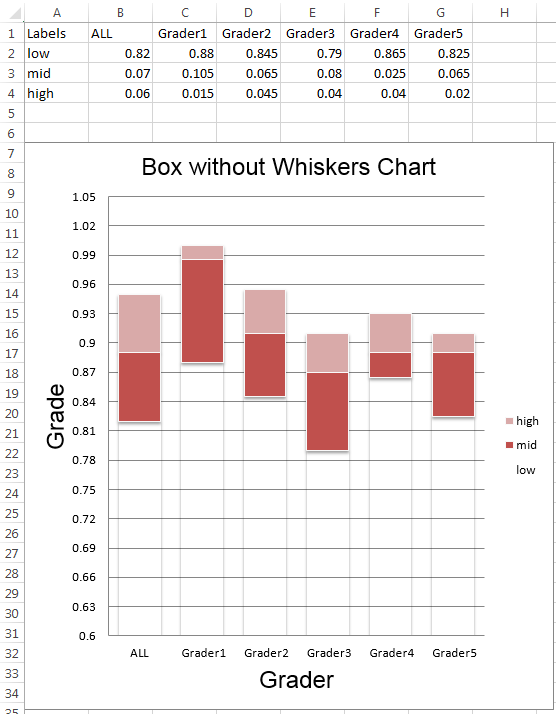

## Example 1
In example 1, Grader1, in his/her frustration with the job, has given out very high 
As for the last two projects.  
Let's see if we can identify this issue using this program/algorithm.

### Input
[input_data_example1.csv](input_data_example1.csv) is a table of hand-generated "random" grades for 
45 students who completed 4 projects, resulting in a total of approximately 180 grades 
(minus a few no submissions). Grader1, in his/her frustration with the job, has given out very high 
As for the last two projects.    
**The grades must be in percent format.**

[input_groups_example1.csv](input_groups_example1.csv) is a table with the 5 graders who graded the
4 projects and their assigned group for each project.   
**The name for each grader must be a unique string, name can not be "ALL".**

### Output
[output_analysis_example1.xlsx](output_analysis_example1.xlsx) is an Excel file with the output of
this program. It contains three spreadsheets.

1. **Analysis Output**  
      
    The first spreadsheet contains the whiskers, quartiles, (M N n x) from the hypergeometric CDF 
calculation, and the CDFs for each quartile.  
    Quartiles are relatively colored for each row.  
CDFs are colored between 0 and 1 for each row.
    - A CDF close to 0 means that there is a very low
chance of getting a random set of grades lower than the one this grader has. This indicates that 
the grader is likely giving out grades lower than the other graders.
    - A CDF close to 1 means that
there is a high chance that of getting a random set of grades lower than the one this grader has.
It also means that there is a very LOW chance of getting a set of grades higher. This indicates that
the grader is likely giving out grades higher than the other graders.
    
    It is important to also look at the quartiles to better understand the distribution of grades.
    Keep in mind that it is entirely possible that a grader has as set of lower/higher grades by 
    chance.  

    The table indicates that Grader1 is likely improperly grading assignments, since his/her three
    quartiles are higher than the others and that the CDFs are very close to 1. In fact, with a Q3
    of 1, 25% or more of this grader's grades are 100%. Grader3 is giving grades lower than the
    graders. However, it should *usually* be more difficult to do so if graders have to justify
    their deductions in feedback.

2. **Raw Data By Grader**  
      
    The second spreadsheet contains the grades given out sorted by each grader and colored relative
    to the other grades on that spreadsheet. This can be used to look for any trends.  
    
    The table indicates that Grader1, at some point, gave out many high grades in a row.
    
3. **Box And Whisker**  
      
    The third spreadsheet contains a box plot (no whiskers and no outliers). This helps to visually
    compare the three quartiles for each grader and to compare the distributions of the middle 50%
    with that of all the grades combined.
    
    This chart provides a visual feel for how the graders are doing. It is important to keep in mind
    the scale of the y-axis.
    
    The chart makes it easy to see that Grader1 has the highest 3rd and 2nd quartiles. It does not
    seem very likely that this grader would have half of 32 grades above a 98%.
    
    